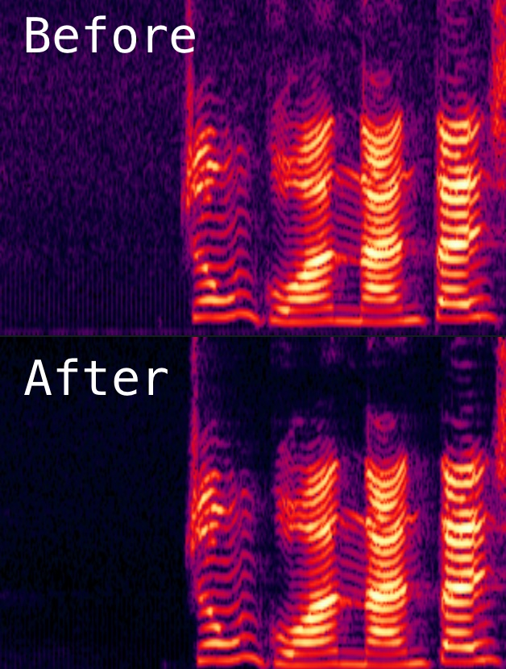

Python bindings of speexdsp noise suppression library
===================

Modified from a https://github.com/xiongyihui/speexdsp-python

## Requirements
+ swig
+ compile toolchain
+ python
+ libspeexdsp-dev

## Build

    ```
    sudo apt install libspeexdsp-dev
    sudo apt install swig
    python setup.py install
    ```

## Get started
```python
"""Acoustic Noise Suppression for wav files."""

import wave
import sys
from speexdsp_ns import NoiseSuppression


if len(sys.argv) < 3:
    print('Usage: {} near.wav out.wav'.format(sys.argv[0]))
    sys.exit(1)


frame_size = 256

near = wave.open(sys.argv[1], 'rb')

if near.getnchannels() > 1:
    print('Only support mono channel')
    sys.exit(2)

out = wave.open(sys.argv[2], 'wb')
out.setnchannels(near.getnchannels())
out.setsampwidth(near.getsampwidth())
out.setframerate(near.getframerate())


print('near - rate: {}, channels: {}, length: {}'.format(
        near.getframerate(),
        near.getnchannels(),
        near.getnframes() / near.getframerate()))

noise_suppression = NoiseSuppression.create(frame_size, near.getframerate())

in_data_len = frame_size
in_data_bytes = frame_size * 2

while True:
    in_data = near.readframes(in_data_len)
    if len(in_data) != in_data_bytes:
        break

    in_data = noise_suppression.process(in_data)

    out.writeframes(in_data)

near.close()
out.close()
```

Noise suppression as show in figure below:


